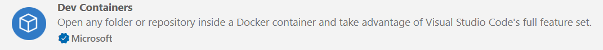
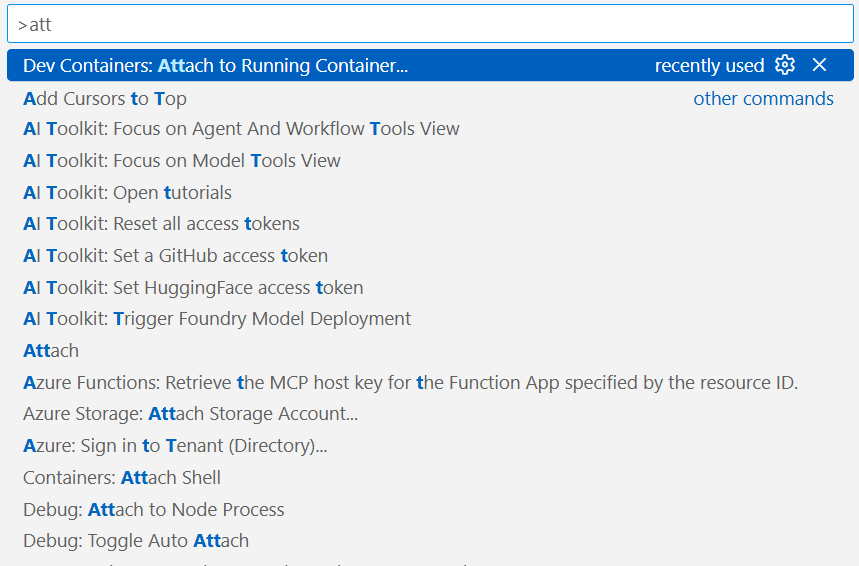
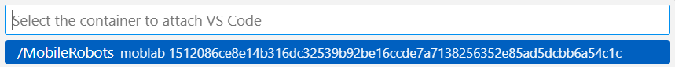

# Mobile-Robots-Practical-Lab

## 📥 Installation

### 1️⃣ Install Docker

If Docker is not already installed, follow the official Docker installation guide for your operating system:

- **Ubuntu**: https://docs.docker.com/engine/install/ubuntu/
- **macOS**: https://docs.docker.com/desktop/install/mac-install/
- **Windows (WSL2 required)**: https://docs.docker.com/desktop/install/windows-install/

Verify the installation:

```bash
docker --version
```

### 2️⃣ Clone Repositry 
In Wsl clone repo and get inside workspace:

```bash
git clone https://github.com/THI-Robotics-Lab/Mobile-Robots-Practical-Lab.git

cd Mobile-Robots-Practical-Lab
```

### 3️⃣ Run Docker Container

Run shell script which start the container: 

```bash
./Scripts/start_container.sh
```

### 4️⃣ Vscode Integration

1. Install Visual Studio Code

2. Install the Dev Containers extension

    

3. Press Ctrl + Shift + P and select Dev Containers: Attach to Running Container

    

4. Choose `MobileRobots`

    

## 👨‍💻 Developed By

- Prof Dr-ing Alen Turnwald Alen.Turnwald@thi.de
- Asser Soliman ass1728@thi.de